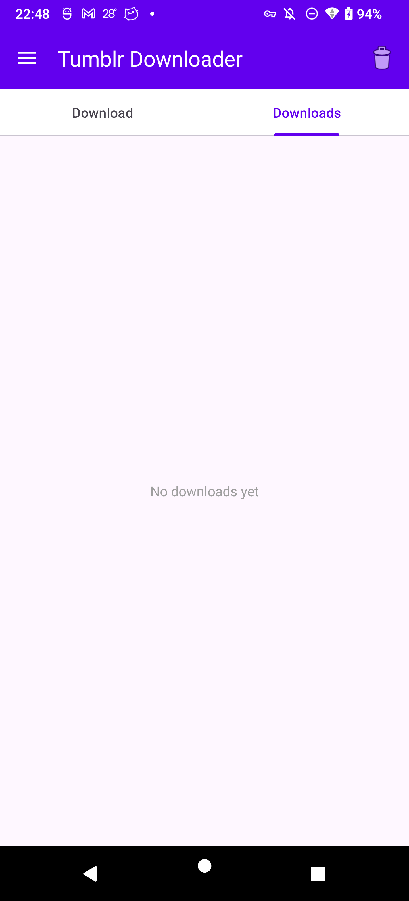
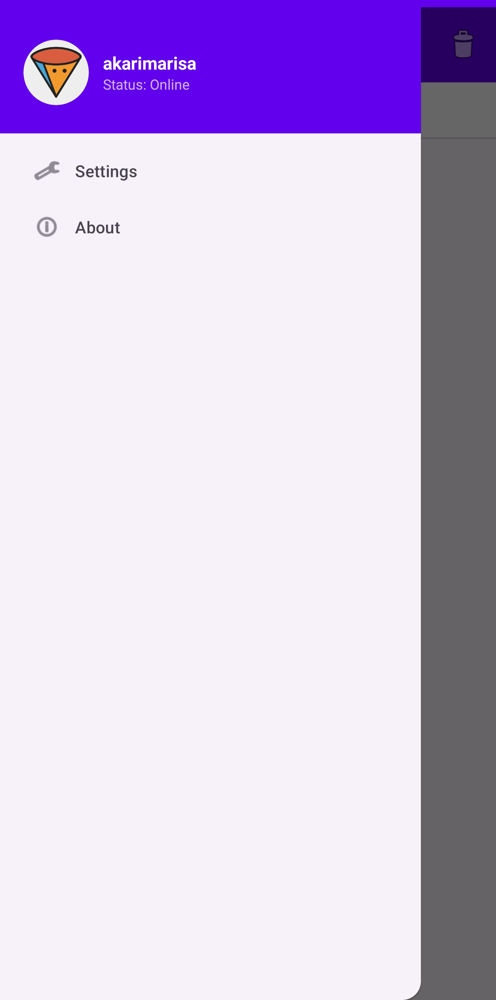
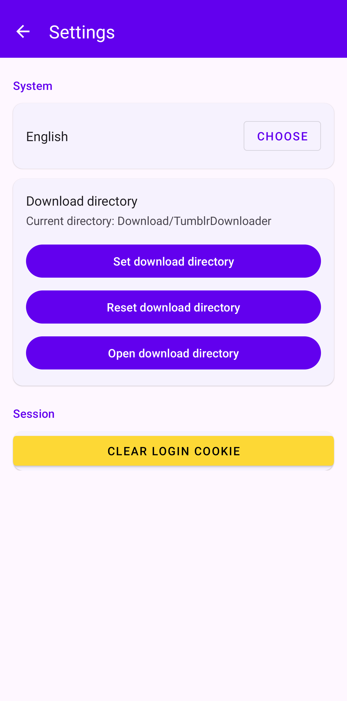
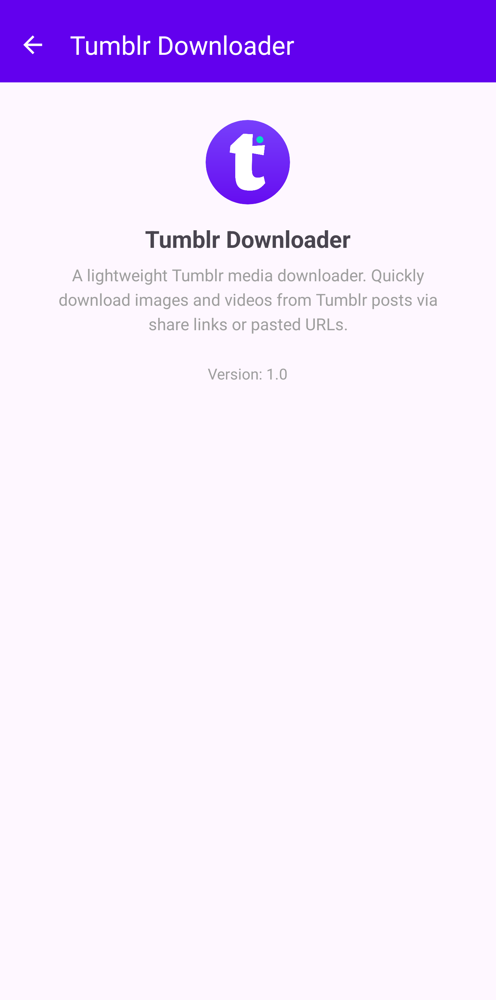

# Tumblr Downloader

[](LICENSE)
[](https://developer.android.com)
[](https://developer.android.com/studio)
[](https://kotlinlang.org)

[🇨🇳 **中文**](README_zh.md)

An Android app that downloads images and videos from Tumblr posts. Supports Android 11+.

<p align="center">
  
</p>

<p align="center">
  <a href="https://ko-fi.com/E0C822IGF6">
    
  </a>
</p>

---

## Features

- **Download media** from Tumblr posts — images and videos
- **Multiple sources**: paste a link, share from other apps, or auto-detect from clipboard
- **Smart parsing**: extracts media from Tumblr's oEmbed API and page HTML; supports `.pnj` high-quality images
- **Login flow**: built-in WebView-based login to access private/restricted posts
- **Cookie persistence**: login cookies stored locally with security notice; survives app restart
- **Download queue**: sequential download with pause/resume, retry, and rate limiting
- **History**: download records survive app restarts
- **Media viewer**: view downloaded images and videos in-app
- **Custom download directory**: save to any folder via Storage Access Framework
- **Multi-language**: English and Chinese UI

---

## Screenshots

| Download | Downloads | Navigation | Settings | About |
|---|---|---|---|---|
|  |  |  |  |  |

---

## Project Structure

```
app/src/main/java/com/example/tumblrdownloader/
├── TumblrDownloaderApplication.kt      # App entry point
├── MainActivity.kt                     # Single-activity host with TabLayout
├── MainViewModel.kt                    # Shared ViewModel bridging UI and state
├── model/
│   ├── DownloadItem.kt                 # Data class for a single download
│   ├── DownloadStateManager.kt         # Sequential command processor for queue
│   └── MediaType / DownloadStatus      # Enums
├── service/
│   └── DownloadService.kt              # Foreground service for actual downloads
├── ui/
│   ├── download/
│   │   ├── DownloadFragment.kt         # Input URL + trigger download
│   │   ├── DownloadsFragment.kt        # Download queue list
│   │   └── DownloadsAdapter.kt         # RecyclerView adapter
│   ├── auth/
│   │   └── TumblrLoginActivity.kt      # WebView-based Tumblr login
│   ├── media/
│   │   └── MediaViewerActivity.kt      # View downloaded images/videos
│   ├── settings/
│   │   └── SettingsActivity.kt         # Download dir, cookies, language
│   ├── about/
│   │   └── AboutActivity.kt
│   └── OnboardingActivity.kt           # First-launch walkthrough
└── utils/
    ├── TumblrParser.kt                 # Parse share URLs → media URLs
    ├── TumblrCookieStore.kt            # Persist/restore WebView cookies
    ├── TumblrAccountStore.kt           # Fetch & cache account info
    ├── DownloadUtils.kt                # File naming, directory helpers
    ├── DownloadHistoryStore.kt         # Persist download queue to disk
    ├── CompletedMediaStore.kt          # Track already-downloaded files
    └── LocaleHelper.kt                 # Per-app language override
```

---

## Architecture

The app follows a **single-activity + fragments** pattern with **MVVM**.

```
User Input → DownloadFragment
                  ↓
           MainViewModel
                  ↓
    DownloadStateManager (sequential command queue)
          ↙            ↘
  TumblrParser      DownloadService
  (URL → media)     (foreground, HTTP)
                        ↓
                  MediaStore / SAF
```

Key design decisions:

- **Sequential command processor** (`DownloadStateManager`): All state mutations go through a single coroutine channel, eliminating race conditions between user actions and download progress callbacks.
- **Two-phase parsing**: First tries Tumblr's oEmbed API (lightweight), then falls back to full page HTML parsing. JSON-structured data uses path-based filtering rather than fragile extension matching.
- **Cookie bridge**: WebView login cookies are persisted via `CookieManager` and shared with the OkHttp client used for parsing and downloading.

---

## Requirements

| Requirement | Version |
|---|---|
| Android | 11+ (API 30) |
| JDK | 17+ |
| Android Studio | Hedgehog (2023.1.1) or later |
| Gradle | 8.4+ |

---

## Build & Install

### Using Android Studio

1. Clone the repo:
   ```bash
   git clone https://github.com/AkariMarisa/Tumblr-Downloader.git
   ```
2. Open the project in Android Studio.
3. Let Gradle sync complete.
4. Select a physical device or emulator (API 30+) and run.

### Using command line

```bash
# Build debug APK
./scripts/build_local.sh

# Install on connected device
adb install -r app/build/outputs/apk/debug/app-debug.apk
```

> **Note:** There is no Gradle wrapper (`gradlew`) in the repo — use the system `gradle` command or the bundled `scripts/build_local.sh` which sets the required `JAVA_HOME` and `ANDROID_HOME`.

---

## Usage

1. Open the app.
2. **Paste a Tumblr share URL** into the input field and tap **Download**.
3. Or **share a link** from another app (browser, Tumblr app) — the app will auto-detect it.
4. The app parses the URL and adds found media to the download queue.
5. Switch to the **Downloads** tab to monitor progress.
6. Tap a completed item to view the media.

### Login

For private or restricted posts:
1. Tap **Download** — the app will detect that login is required and open the login screen.
2. Sign in to your Tumblr account in the WebView.
3. Once logged in, the app saves the session cookies and retries the download automatically.

---

## Tech Stack

| Library | Purpose |
|---|---|
| [Kotlin](https://kotlinlang.org) | Language |
| [AndroidX](https://developer.android.com/jetpack/androidx) | Core, AppCompat, Fragment, Lifecycle, ViewPager2, RecyclerView |
| [Material Components](https://material.io/develop/android) | UI components |
| [OkHttp](https://square.github.io/okhttp/) | HTTP client for Tumblr API & media download |
| [Retrofit](https://square.github.io/retrofit/) | (Available for future API integration) |
| [Glide](https://github.com/bumptech/glide) | Image loading & caching |
| [ExoPlayer](https://developer.android.com/media/media3/exoplayer) | Video playback |
| [Coroutines](https://kotlinlang.org/docs/coroutines-overview.html) | Async operations |
| [ViewBinding](https://developer.android.com/topic/libraries/view-binding) | Type-safe view access |
| [Room](https://developer.android.com/training/data-storage/room) | (Available for future schema-based storage) |

---

## To-Do

### Reliability

- [x] **Clipboard auto-detect**: Use `onWindowFocusChanged(true)` (Android 10+ requires focus to read clipboard). Cold start skip — only detect when switching back. Persistent dedup via SharedPreferences; delete/clear tasks resets cache. Settings toggle to disable. Auto-switch to Download tab with loading overlay on detection.
- [ ] **Network-aware queue management**: When WiFi disconnects, active downloads fail naturally after 3 retries; queued items pause immediately. No auto-resume. Add "Pause All" / "Resume All" buttons for batch queue control.
- [x] **Cookie persistence race**: Added `waitForCookiesReady()` in `TumblrCookieStore` — polls `CookieManager.getCookie()` on login hosts with 5s timeout before retrying parse. Login retry now waits until cookies are actually visible.
- [x] **Login loop fix**: `retryAfterLogin` flag prevents re-opening login page on failed retry. 10s throttle on login redirects. `loginLaunchPending` guard in DownloadFragment.
- [x] **SharedPreferences corruption**: Download history and cookie store use plain JSON in SharedPreferences — can break on concurrent writes or crash during save. Migrated to Room (AppDatabase with DAOs). Legacy data auto-migrated on first launch; SharedPreferences are cleared after migration. Auto-detect dedup cache (`last_auto_detected_url`) intentionally left in SharedPreferences (single string, loss is harmless).
- [x] **Progress listener race**: Fixed ViewModel `onCleared()` incorrectly nulling `DownloadService.progressListener` when a transient ViewModel overwrote it. Guard: only set the static listener if it isn't already set — the first ViewModel to register wins.
- [x] **Crash-safe command processor**: `for` loop in `DownloadStateManager` wrapped in `try`/`catch` so an unhandled exception won't silently kill the channel consumer.
- [x] **`isColdStart` survives Activity recreation**: Changed from `MainActivity` instance field to `companion object @Volatile` flag so clipboard check isn't skipped after recreation.
- [x] **`isLikelyPostMedia` accepts extensionless URLs**: Accept `media.tumblr.com` URLs without file extension — the noise-path + host-domain filters already provide sufficient precision.
- [x] **Retry failed downloads**: `processAppend` dedup skips `FAILED` items — users can re-download a failed post without manually removing it first.
- [x] **WebViewCookieJar subdomain fallback**: When `cookieManager.getCookie(url)` returns null for `*.tumblr.com` subdomain requests, fall back to `https://www.tumblr.com/` to retrieve cookies.
- [x] **Adult content detection**: Added `looksLikeAdultContentPage()` to detect Tumblr's adult content interstitial. The parser now first tries a relaxed JSON extraction (media URLs are often still in `__INITIAL_STATE__` under non-standard keys), and falls back to returning `LoginRequired` to open a browser for the user to click through the warning.
- [ ] **Private post support**: `/private/...` URLs cannot be parsed via HTTP (JS-rendered). Two approaches under consideration:
  - **WebView parser**: Load URL in a hidden WebView, wait for JS rendering, extract `__INITIAL_STATE__` / DOM media URLs via `evaluateJavascript()`.
  - **Tumblr API v2 + OAuth**: Register app for API credentials, use `/posts/{id}` endpoint with OAuth tokens to fetch post content as JSON.

- [ ] **Drawer avatar: navigate to user settings when logged in**: Currently clicking the avatar only opens the login page. When already logged in, the login page shows the dashboard (confusing). Should open user settings or profile instead.
- [ ] **Parallel downloads**: Currently sequential only (one at a time). Allow configurable parallel downloads (2-3).
- [ ] **Batch download**: Download all media from a blog, tag, or collection of posts.
- [ ] **Video quality selection**: Let users prefer 480p / 720p / 1080p when multiple renditions exist.
- [ ] **Download speed display**: Show real-time speed (KB/s) in notifications and download list.
- [ ] **Dark mode**: Follow system theme or allow manual toggle.
- [ ] **Search & filter**: Search by URL, filter by status (downloading / completed / failed) in the download list.
- [ ] **Notification actions**: Pause / cancel download directly from the notification.
- [ ] **Export / import history**: Backup and restore download history across devices.
- [ ] **Save to gallery**: Option to save completed downloads to the device gallery.

### Parse & Download Engine

- [ ] **MIME type fallback**: For URLs with unknown extensions, send a HEAD request to check `Content-Type` before falling back to `application/octet-stream`.
- [ ] **Parse diagnostics panel**: Show why parsing returned no results (404 / rate-limited / auth required / no media found).
- [ ] **Full-link log system**: Local log capture (no Firebase/cloud). Include download flow, parse results, cookie state, and WebView interactions. Exportable log file for user debugging.
- [ ] **Adaptive rate-limit settings**: Configurable speed limit (500 KB/s – 2 MB/s) and inter-task gap.
- [ ] **Cookie test entry**: Manual cookie paste in Settings for debugging private posts without re-login.
- [ ] **Refactor `inferExtension`**: The same logic appears in both `DownloadService.kt` and `DownloadStateManager.kt` — extract into a shared utility.

### Open Source & Project Health

- [ ] **LICENSE file**: Create the actual MIT `LICENSE` file in the repo root (README references it but the file doesn't exist).
- [ ] **Gradle wrapper**: Add `gradlew` so builds don't require a system Gradle installation.
- [ ] **CI/CD**: GitHub Actions for automated build, lint, and test on every PR.
- [ ] **Package name**: Rename from `com.example` to a proper namespace before publishing.
- [x] **Room DAO + migration tests**: 19 unit tests for `DownloadHistoryDao`, `CookieDao`, and migration from SharedPreferences (Robolectric + Room in-memory).
- [ ] **More tests**: Add unit tests for `TumblrParser`, `DownloadStateManager`, and instrumentation tests for the full download flow.
- [ ] **Contributing guide**: Create `CONTRIBUTING.md` and `CODE_OF_CONDUCT.md`.
- [x] **Screenshots**: Add app screenshots to README.
- [ ] **Play Store / F-Droid**: Prepare release signing and store listings (publish to F-Droid).

---

## Contributing

Contributions are welcome! Feel free to open an issue or submit a pull request.

Before contributing, please read our [Contributing Guidelines](CONTRIBUTING.md) and [Code of Conduct](CODE_OF_CONDUCT.md).

### Development

```bash
# Fork and clone
git clone https://github.com/your-username/Tumblr-Downloader.git
cd Tumblr-Downloader

# Build
./scripts/build_local.sh

# Run tests (when available)
./gradlew test
```

---

## License

This project is licensed under the MIT License. See the [LICENSE](../LICENSE) file for details.
