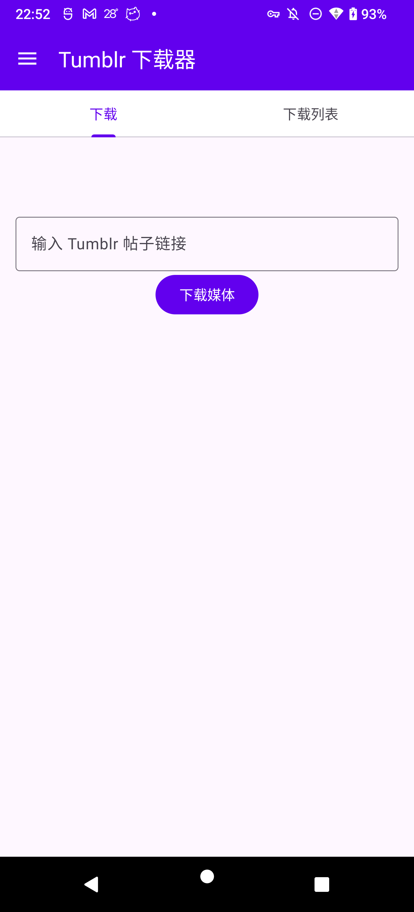
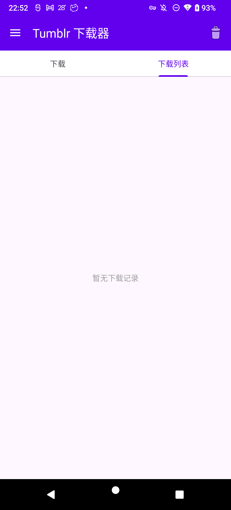
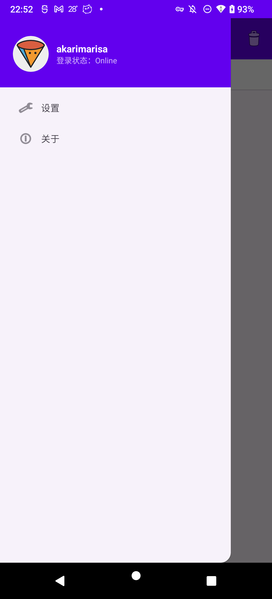
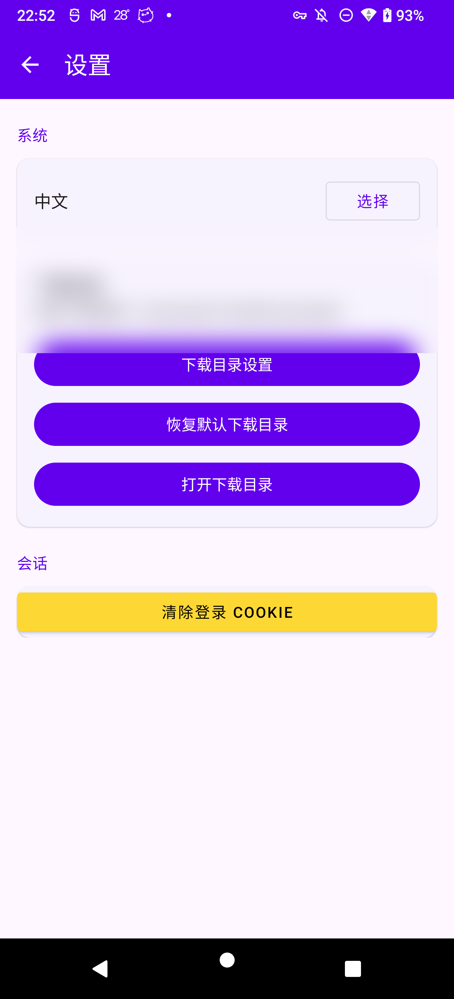
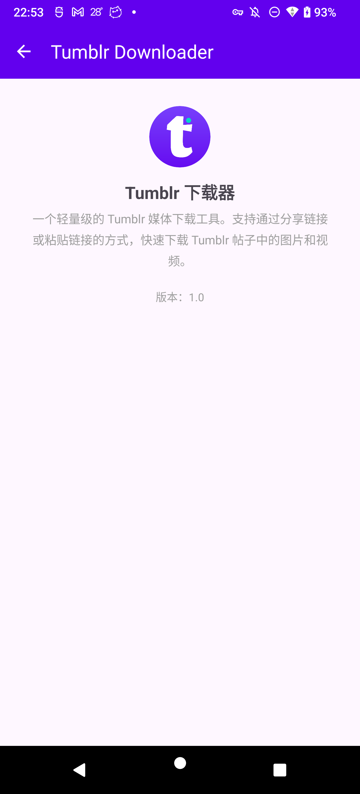

# Tumblr Downloader

[](LICENSE)
[](https://developer.android.com)
[](https://developer.android.com/studio)
[](https://kotlinlang.org)

[🇬🇧 **English**](README.md)

一个从 Tumblr 帖子中下载图片和视频的 Android 应用。支持 Android 11+。

<p align="center">
  
</p>

<p align="center">
  <a href="https://ko-fi.com/E0C822IGF6">
    
  </a>
</p>

---

## 功能特点

- **下载媒体** — 从 Tumblr 帖子下载图片和视频
- **多种输入方式** — 粘贴链接、从其他应用分享、自动检测剪贴板
- **智能解析** — 支持 oEmbed API 和页面 HTML 两种解析方式；识别 `.pnj` 高清图片
- **内置登录** — WebView 登录流程，可访问私密/受限帖子
- **Cookie 持久化** — 登录态本地存储，重启后可复用；含安全提示
- **下载队列** — 顺序下载，支持暂停/继续/重试/限速
- **历史记录** — 下载记录持久化，重启不丢失
- **媒体查看** — 在应用内查看已下载的图片和视频
- **自定义目录** — 通过 Storage Access Framework 选择任意保存位置
- **多语言** — 中文和英文界面

---

## 截图

### 中文界面

| 下载 | 下载列表 | 导航 | 设置 | 关于 |
|---|---|---|---|---|
|  |  |  |  |  |


---

## 项目结构

```
app/src/main/java/com/example/tumblrdownloader/
├── TumblrDownloaderApplication.kt      # 应用入口
├── MainActivity.kt                     # 主 Activity（单 Activity + TabLayout）
├── MainViewModel.kt                    # 共享 ViewModel，连接 UI 与状态管理
├── model/
│   ├── DownloadItem.kt                 # 下载项数据类
│   ├── DownloadStateManager.kt         # 顺序命令处理器，负责下载队列状态
│   └── MediaType / DownloadStatus      # 枚举
├── service/
│   └── DownloadService.kt              # 前台服务，实际执行下载
├── ui/
│   ├── download/
│   │   ├── DownloadFragment.kt         # 输入 URL + 触发下载
│   │   ├── DownloadsFragment.kt        # 下载队列列表
│   │   └── DownloadsAdapter.kt         # RecyclerView 适配器
│   ├── auth/
│   │   └── TumblrLoginActivity.kt      # WebView 登录
│   ├── media/
│   │   └── MediaViewerActivity.kt      # 查看已下载的图片/视频
│   ├── settings/
│   │   └── SettingsActivity.kt         # 下载目录、Cookie、语言等设置
│   ├── about/
│   │   └── AboutActivity.kt
│   └── OnboardingActivity.kt           # 首次启动引导
└── utils/
    ├── TumblrParser.kt                 # 解析分享链接 → 媒体 URL
    ├── TumblrCookieStore.kt            # 持久化/恢复 WebView Cookie
    ├── TumblrAccountStore.kt           # 获取和缓存账户信息
    ├── DownloadUtils.kt                # 文件命名、目录辅助
    ├── DownloadHistoryStore.kt         # 下载队列持久化
    ├── CompletedMediaStore.kt          # 跟踪已下载文件（防重复）
    └── LocaleHelper.kt                 # 应用内语言切换
```

---

## 架构

采用 **单 Activity + Fragment** 模式，配合 **MVVM** 架构。

```
用户输入 → DownloadFragment
              ↓
       MainViewModel
              ↓
DownloadStateManager (顺序命令队列)
      ↙            ↘
TumblrParser      DownloadService
(URL → 媒体列表)   (前台服务, HTTP 下载)
                      ↓
                MediaStore / SAF
```

关键设计：

- **顺序命令处理器** (`DownloadStateManager`)：所有状态变更通过单一协程通道处理，消除用户操作与下载回调之间的竞态条件。
- **两阶段解析**：先尝试 Tumblr 的 oEmbed API（轻量），再回退到完整页面 HTML 解析。JSON 结构化数据采用路径过滤而非脆弱的扩展名匹配。
- **Cookie 桥接**：WebView 登录后的 Cookie 通过 `CookieManager` 持久化，与解析/下载用的 OkHttp 客户端共享。

---

## 环境要求

| 要求 | 版本 |
|---|---|
| Android | 11+ (API 30) |
| JDK | 17+ |
| Android Studio | Hedgehog (2023.1.1) 或更新版本 |
| Gradle | 8.4+ |

---

## 构建与安装

### 使用 Android Studio

1. 克隆仓库：
   ```bash
   git clone https://github.com/AkariMarisa/Tumblr-Downloader.git
   ```
2. 在 Android Studio 中打开项目。
3. 等待 Gradle 同步完成。
4. 选择物理设备或模拟器（API 30+），运行。

### 使用命令行

```bash
# 构建 debug APK
./scripts/build_local.sh

# 安装到已连接的设备
adb install -r app/build/outputs/apk/debug/app-debug.apk
```

> **注意：** 仓库中没有 Gradle wrapper（`gradlew`），请使用系统 `gradle` 命令或项目自带的 `scripts/build_local.sh`（会自动设置 `JAVA_HOME` 和 `ANDROID_HOME`）。

---

## 使用方法

1. 打开应用。
2. **粘贴 Tumblr 分享链接** 到输入框，点击 **下载**。
3. 或者从其他应用（浏览器、Tumblr 官方应用）**分享链接**到本应用。
4. 应用解析链接后，将找到的媒体添加到下载队列。
5. 切换到 **下载列表** 标签页查看进度。
6. 点击已完成的项目查看媒体。

### 登录

对于私密或受限帖子：
1. 点击 **下载** — 应用检测到需要登录时会自动打开登录页面。
2. 在 WebView 中登录你的 Tumblr 账号。
3. 登录成功后，应用会自动保存会话 Cookie 并重试下载。

---

## 技术栈

| 库 | 用途 |
|---|---|
| [Kotlin](https://kotlinlang.org) | 编程语言 |
| [AndroidX](https://developer.android.com/jetpack/androidx) | Core, AppCompat, Fragment, Lifecycle, ViewPager2, RecyclerView |
| [Material Components](https://material.io/develop/android) | UI 组件 |
| [OkHttp](https://square.github.io/okhttp/) | Tumblr API 和媒体下载的 HTTP 客户端 |
| [Retrofit](https://square.github.io/retrofit/) | （预留，未来可能用于 API 集成） |
| [Glide](https://github.com/bumptech/glide) | 图片加载与缓存 |
| [ExoPlayer](https://developer.android.com/media/media3/exoplayer) | 视频播放 |
| [Coroutines](https://kotlinlang.org/docs/coroutines-overview.html) | 异步操作 |
| [ViewBinding](https://developer.android.com/topic/libraries/view-binding) | 类型安全的视图访问 |
| [Room](https://developer.android.com/training/data-storage/room) | （预留，未来可能用于结构化存储） |

---

## 待办

### 可靠性

- [x] **剪贴板自动检测**：改用 `onWindowFocusChanged(true)`（Android 10+ 需要窗口聚焦才能读取剪切板）。冷启动跳过——只在切回时检测。持久化去重（SharedPreferences），删除/清空任务时自动重置缓存。设置页开关可关闭。检测时自动切换到下载 tab 显示 loading 遮罩。
- [ ] **网络切换时自动重试**：WiFi 断开时暂停下载，重新连接后自动继续
- [x] **Cookie 同步竞态**：在 `TumblrCookieStore` 中添加了 `waitForCookiesReady()`——在重试解析前轮询 `CookieManager.getCookie()` 直至 Cookie 可见（超时 5 秒）。登录重试现在会等待 Cookie 实际就绪再执行。
- [x] **登录循环修复**：`retryAfterLogin` 标志位防止重试失败后重复打开登录页。10 秒登录重定向节流。`loginLaunchPending` 守卫避免重复启动登录 Activity。
- [ ] **SharedPreferences 损坏**：下载历史记录和 Cookie 使用纯 JSON 存储在 SharedPreferences 中，并发写入或崩溃可能导致数据损坏。建议迁移到 Room 或事务性存储
  > **注**：自动检测去重缓存（`last_auto_detected_url`）同样使用 SharedPreferences，但故意不迁移——它只是一个字符串、只在主线程写入、丢失也无害（最多同一条链接被重新检测一次）。
- [x] **WebViewCookieJar 子域名回退**：当 `cookieManager.getCookie(url)` 对 `*.tumblr.com` 子域名返回 null 时，回退到 `https://www.tumblr.com/` 获取 Cookie。
- [ ] **成人内容检测**：Tumblr 对含成人内容的帖子有额外拦截页，需改进 `looksLikeLoginPage` 对此边缘情况的处理
- [ ] **私密帖子支持**：`/private/...` URL 无法通过 HTTP 解析（JS 动态渲染），两条路线待评估：
  - **WebView 解析器**：用隐藏 WebView 加载帖子页面，等待 JS 渲染后通过 `evaluateJavascript()` 提取 `__INITIAL_STATE__` / DOM 里的媒体 URL
  - **Tumblr API v2 + OAuth**：注册应用获取 API 凭证，用 `/posts/{id}` 接口 + OAuth 令牌获取帖子 JSON 数据

### 功能

- [ ] **并行下载**：目前仅支持单任务顺序下载，增加可配置的并行下载数（2-3 个）
- [ ] **批量下载**：一键下载某个博客、标签或帖子合集的所有媒体
- [ ] **视频画质选择**：当存在多个清晰度时，让用户选择 480p / 720p / 1080p
- [ ] **下载速度显示**：在通知栏和下载列表中显示实时速度（KB/s）
- [ ] **深色模式**：跟随系统主题或手动切换
- [ ] **搜索与过滤**：按 URL 搜索、按状态（下载中/已完成/失败）过滤下载列表
- [ ] **通知栏操作**：直接在通知中暂停/取消下载
- [ ] **导出/导入历史**：备份和恢复下载记录
- [ ] **保存到相册**：完成后可选择保存到系统相册

### 解析与下载引擎

- [ ] **MIME 类型回退检测**：对于未知扩展名的 URL，先发 HEAD 请求检查 `Content-Type`，而非直接当成 `application/octet-stream`
- [ ] **解析诊断面板**：显示解析失败的具体原因（404 / 限流 / 需要登录 / 未找到媒体）
- [ ] **限速配置**：可调节的下载速度限制（500 KB/s – 2 MB/s）和任务间隔时间
- [ ] **Cookie 测试入口**：设置中提供手动粘贴 Cookie 的入口，方便调试私密帖子
- [ ] **重构 `inferExtension`**：`DownloadService.kt` 和 `DownloadStateManager.kt` 中存在重复逻辑，应抽取到共享工具类

### 开源与项目健康

- [ ] **LICENSE 文件**：在仓库根目录创建实际的 MIT `LICENSE` 文件（README 已引用但文件不存在）
- [ ] **Gradle wrapper**：添加 `gradlew` 以便无需系统安装 Gradle 即可构建
- [ ] **CI/CD**：配置 GitHub Actions，PR 时自动构建、lint、跑测试
- [ ] **包名重命名**：从 `com.example` 改为正式命名空间后再发布
- [ ] **测试**：补充 `TumblrParser`、`DownloadStateManager` 的单元测试，以及下载流程的 instrumentation 测试
- [ ] **贡献指南**：创建 `CONTRIBUTING.md` 和 `CODE_OF_CONDUCT.md`
- [x] **截图**：在 README 中添加应用截图
- [ ] **应用商店发布**：准备 Release 签名和商店上架材料（发布到 F-Droid）

---

## 贡献

欢迎贡献！请随时提出 Issue 或提交 Pull Request。

在贡献之前，请阅读[贡献指南](CONTRIBUTING.md)和[行为准则](CODE_OF_CONDUCT.md)。

### 开发

```bash
# Fork 并克隆
git clone https://github.com/your-username/Tumblr-Downloader.git
cd Tumblr-Downloader

# 构建
./scripts/build_local.sh

# 运行测试（待补充）
./gradlew test
```

---

## 许可证

本项目基于 MIT 许可证。详见 [LICENSE](../LICENSE) 文件。
